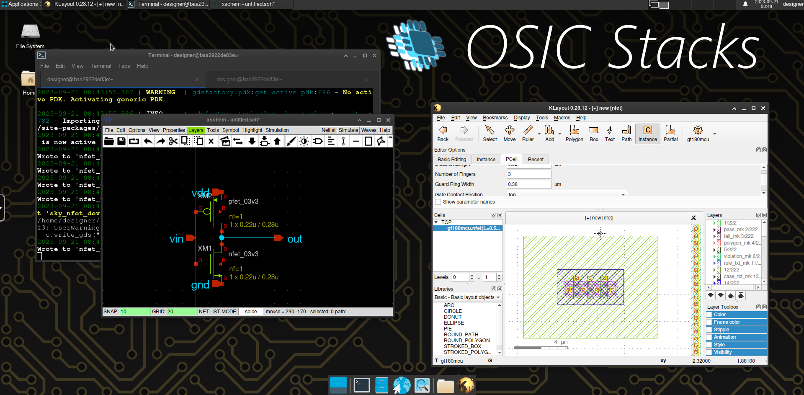

[](https://opensource.org/license/mit/)


# OSIC Stacks
*Open Source Integrated Circuits Docker Stacks*



## Highlights

- Intended for ease to use, have your tools integrate tightly with your PDK.
- IC design tools evolve quickly, a rolling release distribution allows you to have the latest version of your tool set.
- Docker images can be heavy, thus these images are distributed in stacks, choose the best fit for your task.
- Flexible, these containers doesn't restrict you to extend your development environment, feel free to install your own packages.
- Choose between running your applications in a custom linux environment in your web browser or natively in your current desktop environment.

## Stacks

- **analog-xk**: Analog workflow using XSchem & KLayout
- **analog-xm**: Analog workflow using XSchem & Magic
- **analog-heavy**: Workflow with all the analog tools
- **digital-ator**: Digital workflow using Verilator & Yosys
- **digital-icarus**: Digital workflow using Icarus & Yosys
- **digital-heavy**: Workflow with all the digital tools
- **heavy**: Workflow with all the previous tools 

> Flavors: web / desktop

## Usage

Follow these 3 steps to get your container ready.

### 1. Starting a container

There are two ways to start your container. You can choose (a) to start your container in your actual **desktop** environment and launch the applications from your integrated terminal or (b) you can launch a whole linux desktop environment that can be accessed through a **web** browser.

> Before following the next steps make sure you have docker running.

#### 1a. Starting a container in your **desktop** with native graphics output

Scripts are provided for creating the containers in both Windows and Linux.
These scripts automate the binding of graphics environment variables to the container in order to enable graphics inside the docker container.

##### Windows

Execute the next script in powershell and follow the container initialization prompt.
```pwsh
& ([scriptblock]::Create((irm https://git.1159.cl/Mario1159/osic-stacks/raw/branch/main/run.ps1))) -pull -download
```
 This script will run the container inside WSL and bind the enviroments variables for [WSLg](https://github.com/microsoft/wslg/blob/main/samples/container/Containers.md). Also, it will download itself so it will exists locally.

##### Linux
Execute the next script in your terminal replacing `<container_name>` by any name and `<stack>` by an stack from the previous [stack list](#stacks).
```sh
docker run -it -e DISPLAY=$DISPLAY -v /tmp/.X11-unix:/tmp/.X11-unix --name <container_name> git.1159.cl/mario1159/<stack>-desktop
```

> For Wayland compositors make sure you have XWayland installed

##### macOS / OS X

Install `Xquartz` and run the linux previous command.

#### 1b. Starting a container with a **Web** VNC client
If you prefer running the container in your web browser instead of in your integrated terminal, you can select the web flavor of any stack. In this case, it is not necessary to bind extra environment variables for enabling native graphics output.
```sh
docker run -it -p 8444:8444 --name <container_name> git.1159.cl/mario1159/<stack>-web
```

### 2. Connecting to the container

#### 2a. Desktop

Connect to your container with the using the name specified in the previous step.

```sh
docker exec -it <container_name> bash
```

#### 2b. Web

Access from the web to the VNC client at `https://localhost:8444`.

### 3. Configure Volare

List the available PDKs and choose one to install.

| PDK Technology | PDK Variant |
|----------------|-------------|
| sky130         | sky130A     |
|                | sky130B     |
| gf180mcu       | gf180mcuA   |
|                | gf180mcuB   |
|                | gf180mcuC   |

Replace `<pdk_variant>` and `<pdk_tech>` correspondingly by one of the PDKs listed above.
```sh
echo 'export PDK=<pdk_variant>' >> ~/.bashrc 
volare ls-remote --pdk <pdk_tech>
volare enable --pdk <pdk_tech> <version_id>
```

After you have set up the PDK, you can finally start developing your own designs!

## Installing additional packages

For the arch based images you can install packages from the [official arch repository](https://archlinux.org/packages/) using `pacman`.

```pacman -S <package_name>```

or you can also install packages from the [AUR](https://aur.archlinux.org/) using paru.

```paru <package_name>```

## Custom Images

For creating an image with your own pre-installed set of packages for your team you can create your own docker image extending the stacks, just as the stacks extend the base image. For reference check the stacks dockerfiles in the `stack` folder.

The following sections will get you to build and test any of the included stacks or your own custom image.

### Build

Choose a singular stack image to build using docker for the desktop or the web client and replace the `<stack>` placeholder. Keep in mind that following steps are intended to be run from the repository root path.

#### Desktop build

Build the base image and then the stack image.

```sh
docker build --no-cache -t osicstacks-base-desktop -f base/desktop.Dockerfile .
docker build --no-cache --build-arg BASE_IMG=osicstacks-base-desktop --target <stack>-desktop -t <tag> -f stacks/<stack>.Dockerfile .
```

#### Web build

For the web client build the web client base image the required desktop image as well.

```sh
docker build --no-cache -t osicstacks-base-desktop -f base/desktop.Dockerfile .
docker build --no-cache -t osicstacks-base-web -f base/web.Dockerfile .
docker build --no-cache --build-arg BASE_IMG=osicstacks-base-web --target <stack>-web -t <tag> -f stacks/<stack>.Dockerfile .
```


### Local Run

Images can be tested and runned in the following way.

#### Windows
```pwsh
powershell.exe -ExecutionPolicy Bypass run.ps1
```

#### Linux
```sh
docker run -it -e DISPLAY=$DISPLAY -v /tmp/.X11-unix:/tmp/.X11-unix --name <container_name> <tag>
```
